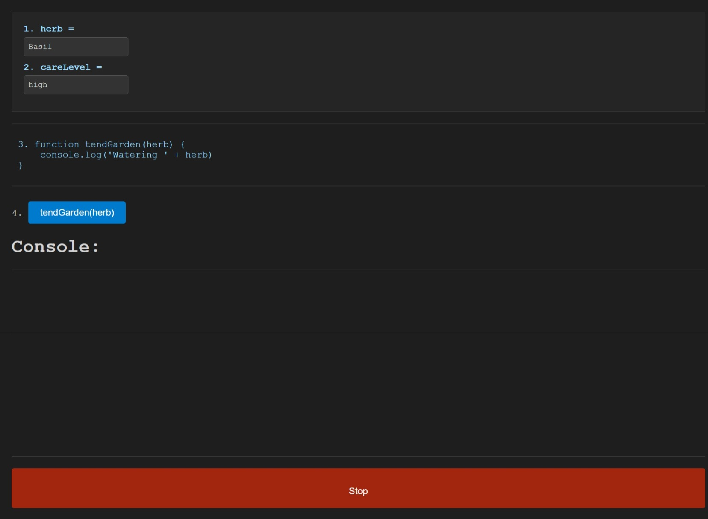

# Nesting Functions Demonstration

## Overview

This project is a simple web demonstration designed to help students learn about JavaScript function nesting and scope. It visually represents how functions are called and how variables are passed and manipulated within nested functions.

## Features

- **Interactive Inputs**: Users can enter values for herbs and care levels, which dynamically update the parameters passed to the functions.
- **Function Display**: The JavaScript function structure is displayed on the page, helping users visualize how the function is built and executed.
- **Console Output**: A simulated console shows what happens when functions are called, including any console log outputs.
- **Control Buttons**: Users can execute the functions with customized parameters and stop the function execution as needed.

## Screenshot

_Screenshot of the Nesting Functions Demonstration interface_

## Accessing the Demo

You can access the live demo of this project at [Nesting Functions Demonstration](https://lesley-byte.github.io/StudentVisualAidNestedFunctions/). No installation or local setup is required, simply visit the link to begin exploring the functionality.

## Usage

- Enter the desired herb and care level in the input fields.
- Click on `Call tendGarden('Herb')` to execute the function with the parameters you provided.
- Observe the function's execution in the console display.
- Use the `Stop` button to stop any ongoing processes (simulated for educational purposes).

## Contributing

Contributions to this project are welcome! To contribute:

1. Fork the repository.
2. Create a new branch for your feature (`git checkout -b feature/AmazingFeature`).
3. Commit your changes (`git commit -m 'Add some AmazingFeature'`).
4. Push to the branch (`git push origin feature/AmazingFeature`).
5. Open a pull request.

## License

This project is licensed under the MIT License - see the [LICENSE](LICENSE) file for details.
